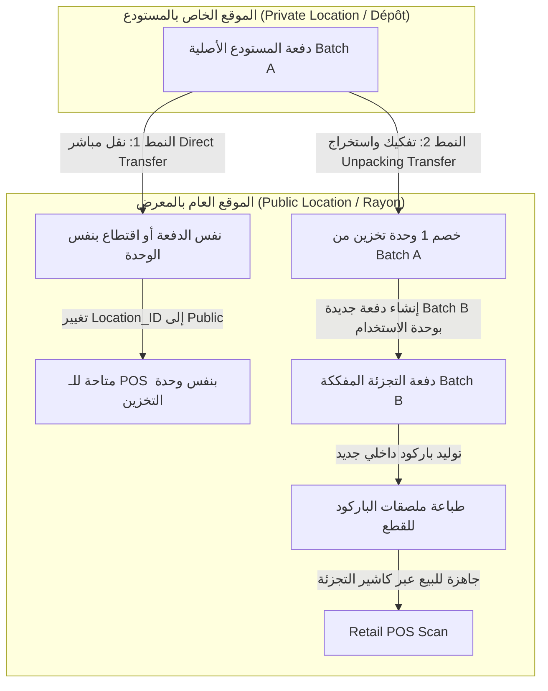

# وثيقة التصميم المعماري الموحد: إدارة المخزون متعدد المستويات (المستودع الخاص بالجملة vs المعرض العام بالتجزئة)
## عبر جدول الدفعات الموحد ومنظومة رؤية المواقع (Private vs Public Locations)

---

## 1. الملخص التنفيذي والتحول المعماري (Executive Summary)

تعتمد هذه الوثيقة المعمارية الرسمية لبرنامج **GstockSW4** على مبدأ **المخزون الموحد الشامل (Single Unified Inventory Model)**، حيث يتم الاستغناء تماماً عن فكرة إنشاء جداول منفصلة لأرصدة الرفوف، والاحتفاظ بجميع السلع والدفعات داخل جدول المخزون الموحد القائم `Inventory_Batches`.

يتحقق الفصل والتمييز الوظيفي الدقيق بين **بضاعة المستودع الكبير/الجملة** و **بضاعة رفوف المعرض/التجزئة** من خلال جدول المواقع `Locations` عبر منظومة **رؤية المواقع (Location Visibility: Private vs. Public)**:
1. **المواقع الخاصة (Private Locations / Dépôt Gros & Réserve)**: تمثل المستودع الرئيسي ومخازن الجملة والتخزين الاحتياطي. الدفعات الموجودة في هذه المواقع تكون **مخفية تماماً** عن نقطة بيع التجزئة (Retail POS)، ومخصصة للبيع بالجملة المباشر وإصدار سندات التزويد والتحويل.
2. **المواقع العامة (Public Locations / Rayonnage & Magasin)**: تمثل رفوف المتجر، مساحات العرض، وطاولات الكاشير. الدفعات الموجودة هنا تكون **متاحة حصرياً** لنقاط البيع بالتجزئة (`Allow_POS_Sales = TRUE`).

---

## 2. منظومة الوحدات الثلاث للمنتج (The 3 Product Units Triad)

يعتمد النظام في بطاقة تعريف كل منتج (`Products_Master`) على ثلاثة مستويات معيارية للوحدات:

```text
+-------------------------------------------------------------------------------+
|                             منظومة وحدات المنتج                               |
+-------------------------------------------------------------------------------+
|  1. وحدة الطلب / الشراء  (Unité de Commande)  : مثل (Palette / Carton Fournisseur) |
|  2. وحدة التخزين بالمستودع (Unité de Stockage)  : مثل (Carton / Boîte / Colis)      |
|  3. وحدة الاستخدام والتجزئة (Unité d'Usage)   : مثل (Pièce / Flacon / Boîte détail) |
+-------------------------------------------------------------------------------+
|  معامل التحويل (Usage_Qty_Per_Stock_Unit)     : عدد وحدات الاستخدام في وحدة التخزين|
+-------------------------------------------------------------------------------+
```

- **وحدة التخزين (`Stock_Unit`)**: هي الوحدة المعتمدة في المستودع الرئيسي (Private Location) لاستقبال وتخزين ومبيعات الجملة (مثل: كرتونة تحتوي على 24 علبة).
- **وحدة الاستخدام والتجزئة (`Usage_Unit`)**: هي الوحدة المعتمدة في رفوف المعرض (Public Location) للبيع بالقطعة للمستهلك النهائي.
- **معامل التحويل (`Usage_Qty_Per_Stock_Unit`)**: يحدد رياضياً عدد القطع الفردية المستخرجة عند تفكيك وحدة تخزين واحدة (مثال: `1 Carton = 24 Pièces`).

---

## 3. آليتا التحويل بين المستودع والرفوف (Transfer Modes)

تتم عمليات نقل البضائع من المواقع الخاصة (المستودع) إلى المواقع العامة (الرفوف) وفق نمطين محددين:



### 3.1. النمط الأول: النقل المباشر (Mode 1: Direct Transfer)
- **حالات الاستخدام**: المنتجات التي تُباع للمستهلك النهائي بنفس هيئة وتغليف تخزينها دون تفكيك (مثل: أجهزة كهرومنزلية، ثلاجات، مستلزمات تباع بالعلبة الكاملة).
- **الإجراء التقني**:
  - نقل الدفعة بالكامل أو اقتطاع كمية جزئية منها من الموقع الخاص (Private) إلى الموقع العام (Public).
  - يتم الاحتفاظ بنفس وحدة التخزين (`Unité de Stockage`) وبنفس الباركود الداخلي.
  - المعاملة المحاسبية: مجرد تغيير لموقع الدفعة `Location_ID = Destination_Public_Location` دون أي تغيير في تسعير الوحدة أو عددها.

### 3.2. النمط الثاني: التحويل مع التفكيك والاستخراج (Mode 2: Unpacking / Extraction Transfer)
- **حالات الاستخدام**: السلع المخزنة في المستودع بالطرود أو الكراتين الكبيرة (Bulk Boxes)، ولكنها تُباع على رفوف المتجر بالقطعة الفردية (Single Pieces).
- **الإجراء التقني والمعاملة البرمجية (Database Transaction)**:
  1. **الخصم من المستودع**: يتم خصم الكمية المحولة (مثلاً: `1 Carton`) من الدفعة المصدر في الموقع الخاص `Private Location`.
  2. **إنشاء دفعة جديدة بالمعرض (New Extracted Batch)**: يتم إنشاء سجل دفعة جديدة في `Inventory_Batches` تابعة للموقع العام `Public Location` بالخصائص التالية:
     - `Product_ID`: نفس معرف المنتج.
     - `Parent_Batch_ID`: يربط بالدفعة المصدر (`Source_Batch_ID`) لضمان التتبع الكامل للشجرة (Lot Traceability).
     - `Batch_Type`: يُحدد كـ `'Extracted_Retail'`.
     - `Stock_Unit`: تُسجل بوحدة الاستخدام (`Unité d'Usage` - مثلاً: `Pièce`).
     - `Quantity_Initial` و `Quantity_Current`: الكمية المستخرجة = (الكمية بالكرتون × `Usage_Qty_Per_Stock_Unit`).
     - `Unit_Price_Received`: سعر تكلفة القطعة المفردة = (سعر تكلفة الكرتونة ÷ معامل التحويل).
     - `Lot_Number` و `Expiry_Date`: ترث نفس رقم التشغيلة وتاريخ الصلاحية من الدفعة الأم الأصلية.
  3. **توليد باركود داخلي جديد (Barcode Generation)**:
     - يولد النظام تلقائياً باركود داخلي فريد للدفعة الجديدة المستخرجة (`Internal_Barcode`).
     - يُتيح النظام للمستخدم فوراً عبر واجهة المستخدم أمر طباعة ملصقات الباركود بعدد القطع المفككة لِلصقها على القطع الفردية قبل وضعها على الرف.

---

## 4. الدورة المستندية والتتبع الكامل (Traceability & Internal Documents)

لضمان الرقابة الصارمة ومنع التلاعب أو الضياع أثناء عملية التفكيك والنقل (Mode 2)، يولد النظام وثيقتين رسميتين متكاملتين:

```text
+-------------------------------------------------------------------------------+
|                    الدورة المستندية لعملية التفكيك والاستخراج                 |
+-------------------------------------------------------------------------------+
| 1. سند خروج وتفكيك من المستودع (Bon de Sortie / Document de Déconditionnement)|
|    - يوثق خروج الكرتونة من المستودع الخاص (Private Location).                |
|    - يوضح بوضوح أن الغرض هو "تفكيك لصالح رفوف المعرض" (Pour Réappro Rayon).   |
|    - يذكر رقم الدفعة المصدر، اسم المنتج، وعدد الكراتين المخرجة.              |
+-------------------------------------------------------------------------------+
| 2. سند استلام داخلي للرف (Bon de Réception Interne)                           |
|    - يوثق استلام وإيداع القطع الناتجة في الموقع العام (Public Location).     |
|    - يوضح صراحة الدفعة الأم الأصلية ومصدر التفكيك (Issu du Déconditionnement)|
|    - يذكر الباركود الداخلي الجديد المولد، وعدد القطع الفردية المستلمة.       |
+-------------------------------------------------------------------------------+
```

- يتم تسجيل العملية في جدول سندات التحويل الداخلي `Internal_Transfers` وبنودها `Internal_Transfer_Items` مع توثيق اسم المستخدم المنشئ، المستلم، تاريخ وتوقيت المعاملة، وتفاصيل التحويل الحسابي.

---

## 5. مصفوفة الصلاحيات والتوزيع الوظيفي للواجهات

| الشاشة / الواجهة | نطاق العمل والموقع المستهدف | العمليات المتاحة |
| :--- | :--- | :--- |
| **شاشة إدارة المستودع الكبير (`tabs_batches`)** | المواقع الخاصة (`Private Locations`) | جرد دفعات المستودع بالكراتين، بيع الجملة، إطلاق النقل المباشر، إطلاق التفكيك للرفوف، وطباعة السندات. |
| **واجهة كاشير التجزئة (`point_of_sale_tab`)** | المواقع العامة (`Public Locations`) فقط | قصر المسح والبيع على الدفعات المتوفرة على الرفوف العامة (`Allow_POS_Sales = TRUE`) بوحدة القطعة. |
| **واجهة مبيعات الجملة (`wholesale_sales_tab`)** | المواقع الخاصة (أو العامة) | بيع الكميات الكبيرة بالكرتون بأسعار الجملة لعملاء B2B مع فواتير A4/A5 والخصم من المستودع. |
| **حوار التفكيك والاستخراج (`UnpackingTransferDialog`)** | ربط (Private ➔ Public) | تحديد عدد الكراتين، احتساب القطع، توليد الباركود الجديد، طباعة ملصقات الباركود، وإصدار السندين. |

---
*تم اعتماد هذه المعمارية الموحدة لضمان أقصى درجات الكفاءة البرمجية والتوافق التام مع هيكل البيانات القائم في GstockSW4.*
