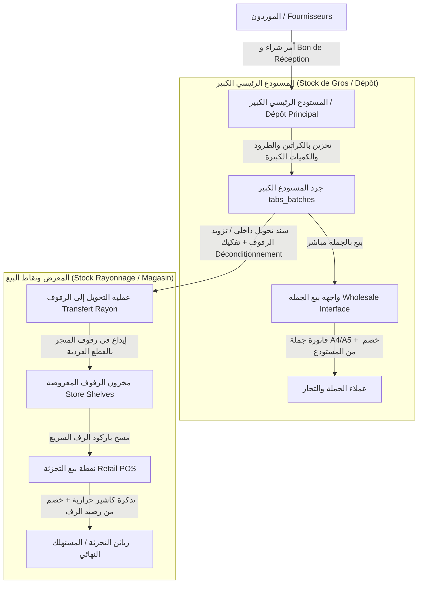

# وثيقة التحليل والتصميم المعماري: الانتقال إلى نظام المخزون الثنائي (مستودع الجملة الكبير + رفوف المعرض والتجزئة)

---

## 1. المقدمة والهدف العام

تهدف هذه الوثيقة إلى تقديم دراسة تحليلية ومعمارية شاملة لتطوير المنطق الداخلي لبرنامج **GstockSW4**، وتحويله من نظام مخزون مركزي موحد إلى **نظام مخزون ثنائي المستوى (Two-Tier Multi-Location Inventory Architecture)** يفصل تماماً واحترافياً بين:
1. **المستودع الرئيسي / مخزن الجملة الكبير (Central Warehouse / Bulk Stock - Dépôt Principal / Gros)**: المخزن الاستراتيجي الذي يستقبل الشحنات الكبيرة من الموردين بالطرود والكراتين، ويُدار من خلال شاشات إدارة الدفعات (`ui/widgets/inventory/tabs_batches`)، ومنه يتم البيع بالجملة مباشرة للتجار والعملاء الكبار.
2. **مخزن المعرض / رفوف المتجر (Store Display / Shelves Inventory - Stock Rayon / Magasin de Vente)**: المخزون الميداني المعروض على الرفوف المخصص للبيع بالتجزئة عبر شاشات نقطة البيع (`ui/widgets/sales/point_of_sale_tab.py`)، والذي يتم تموينه وإعادة تزويده دورياً من المستودع الكبير.

---

## 2. تشخيص وتحليل الوضع الحالي في البرنامج (Current State Analysis)

### 2.1. منطق العمل الحالي في البرنامج
- **رصيد موحد للدفعات**: تُخزن كافة الكميات المتاحة في جدول `Inventory_Batches` بحقل `Quantity_Current`. عند استقبال بضاعة (Bon de Réception - BR)، يتم إنشاء الدفعة برصيد أولي دون تمييز هيكلي بين كون هذه الكمية مخزنة كاحتياطي في المستودع أو موضوعة على رفوف البيع.
- **نقطة البيع (POS)**: تقوم شاشة `PointOfSaleTab` بمسح الباركود والخصم مباشرة من `Inventory_Batches.Quantity_Current` بغض النظر عن موقع التخزين الحقيقي للقطعة.
- **شاشة إدارة الدفعات (`tabs_batches`)**: تعرض كامل المخزون ككتلة واحدة مع فلاتر المواقع (Locations)، ولكنها لا توفر فصلاً وظيفياً يمنع بيع التجزئة من بضاعة المستودع الكبير قبل تحويلها فعلياً إلى الرف.
- **أسعار البيع والتسعير المتعدد**: يتضمن جدول الدفعات مستويات أسعار متعددة (`Selling_Price_HT`, `Selling_Price_HT_2`, `3`, `4`)، إلا أن عملية البيع بالجملة تتم حالياً من نفس واجهة الكاشير المخصصة للمستهلك النهائي، مما يفتقر إلى متطلبات فواتير الجملة، تفكيك الكراتين، وائتمان التجار.

### 2.2. التحديات والثغرات الناتجة عن المنطق الحالي
1. **عدم دقة مطابقة الرفوف مع النظام**: قد يظهر في النظام أن المنتج متوفر (100 قطعة)، بينما الرف فارغ لأن الـ 100 قطعة لا تزال في كراتين مغلقة بالمستودع العلوي، مما يعطل عملية البيع السريع للمستهلك.
2. **فقدان الرقابة على التحويلات الداخلية**: لا توجد دورة مستندية تسجل من قام بنقل البضاعة من المستودع الكبير إلى الرف، ومتى تم ذلك، وما إذا كان هناك كسر أو فقد أثناء النقل.
3. **غياب إدارة التفكيك (Déconditionnement)**: استلام طرد يحتوي على 24 علبة يتطلب إما إدخاله كـ 24 قطعة في المستودع (مما يعيق البيع بالكرتونة بالجملة)، أو إدخاله ككرتونة واحدة (مما يعيق بيع العلبة بالتجزئة على الرف).
4. **تداخل متطلبات بيع الجملة مع بيع التجزئة**: زبون الجملة يحتاج فواتير A4/A5، أسعار تفضيلية حسب الكمية، تتبع حسابات الديون، وشراء بالطرود؛ بينما زبون التجزئة يحتاج سرعة المسح الضوئي، وصل الكاشير الحراري الصغير، والبيع بالقطعة.

---

## 3. المنطق الداخلي الجديد والنموذج التشغيلي (Target Operational Logic)



### 3.1. ركائز المنطق الجديد:
1. **المستودع الرئيسي (Dépôt Principal / Bulk Inventory)**:
   - هو المالك الأصلي للدفعة المشتراة من المورد.
   - يعرض رصيد البضاعة بالجملة/الطرود.
   - العمليات المسموحة:
     - إدخال البضاعة الجديدة عبر الاستقبال (`BR`).
     - البيع بالجملة مباشرة (`Wholesale Sale`).
     - إصدار أمر تزويد الرفوف (`Shelf Replenishment Transfer`).
     - الجرد المستقل للمستودع (`Warehouse Inventory Count`).

2. **مخزن الرفوف والمعرض (Store Shelves / Retail Stock)**:
   - رصيد مخصص حصرياً لنقاط البيع بالتجزئة (`Retail POS`).
   - المنتجات تكون بوحدات الاستهلاك/البيع المباشر (قطعة، علبة، كيس).
   - العمليات المسموحة:
     - استلام البضائع المحولة من المستودع وتأكيد وضعها على الرف.
     - البيع المباشر بالتجزئة عبر الكاشير.
     - إرجاع البضاعة الزائدة أو التالفة إلى المستودع (`Return to Warehouse`).
     - جرد الرفوف السريع (`Shelf Fast Audit`).

3. **آلية التفكيك والتجزئة (Déconditionnement & Unit Unpacking)**:
   - عند تحويل طرد (Colis / Carton يحتوي على مثلاً 12 علبة) من المستودع إلى الرف:
     - يتم خصم `1 طرد` من رصيد المستودع الكبير.
     - يتم إضافة `12 قطعة` إلى رصيد رف المعرض.
     - يتم ربط حركة الخصم والإضافة بنفس المعامل وسند التحويل لضمان تطابق القيمة المالية ومنع أي خلل في التقييم المحاسبي.

---

## 4. التعديلات الهيكلية المقترحة على قاعدة البيانات (Database Schema Blueprint)

### 4.1. تصنيف المواقع (`Locations`)
إضافة حقول لتحديد نوع الموقع وطبيعته:
```sql
ALTER TABLE Locations 
ADD COLUMN Location_Category ENUM('Warehouse_Bulk', 'Store_Shelf', 'Transit', 'Quarantine') 
NOT NULL DEFAULT 'Warehouse_Bulk' AFTER Location_Type;

ALTER TABLE Locations
ADD COLUMN Allow_Direct_POS BOOLEAN NOT NULL DEFAULT FALSE AFTER Location_Category;
```

### 4.2. جدول أرصدة الرفوف الميدانية (`Store_Shelf_Inventory`)
جدول مخصص يربط الدفعات بالرفوف المعروضة لضمان تتبع دقيق ومنفصل عن المستودع:
```sql
CREATE TABLE IF NOT EXISTS Store_Shelf_Inventory (
    Shelf_Item_ID BIGINT UNSIGNED NOT NULL AUTO_INCREMENT PRIMARY KEY,
    Location_ID INT UNSIGNED NOT NULL, -- موقع الرف في المتجر
    Batch_ID INT UNSIGNED NOT NULL,    -- معرف الدفعة الأصلية
    Product_ID INT UNSIGNED NOT NULL,  -- معرف المنتج
    Quantity_On_Shelf DECIMAL(15, 3) NOT NULL DEFAULT 0.000, -- الكمية الفعلية على الرف
    Minimum_Shelf_Level DECIMAL(15, 3) NOT NULL DEFAULT 5.000, -- الحد الأدنى للرف للتنبيه
    Maximum_Shelf_Capacity DECIMAL(15, 3) NOT NULL DEFAULT 50.000, -- الطاقة الاستيعابية للرف
    Last_Replenished_At DATETIME NULL,
    Updated_At DATETIME DEFAULT CURRENT_TIMESTAMP ON UPDATE CURRENT_TIMESTAMP,
    FOREIGN KEY (Location_ID) REFERENCES Locations(Location_ID) ON UPDATE CASCADE,
    FOREIGN KEY (Batch_ID) REFERENCES Inventory_Batches(Batch_ID) ON UPDATE CASCADE,
    FOREIGN KEY (Product_ID) REFERENCES Products_Master(Product_ID) ON UPDATE CASCADE,
    UNIQUE KEY uq_location_batch (Location_ID, Batch_ID)
);
```

### 4.3. جدول سندات تحويل وتزويد الرفوف (`Internal_Shelf_Transfers`)
```sql
CREATE TABLE IF NOT EXISTS Internal_Shelf_Transfers (
    Transfer_ID BIGINT UNSIGNED NOT NULL AUTO_INCREMENT PRIMARY KEY,
    Transfer_No VARCHAR(100) NOT NULL UNIQUE,
    Source_Location_ID INT UNSIGNED NOT NULL,      -- مستودع الجملة الكبير
    Destination_Location_ID INT UNSIGNED NOT NULL, -- الرف / المعرض
    Transfer_Date DATETIME NOT NULL DEFAULT CURRENT_TIMESTAMP,
    Status ENUM('Draft', 'In_Transit', 'Completed', 'Cancelled') NOT NULL DEFAULT 'Completed',
    Created_By INT UNSIGNED NULL,
    Received_By INT UNSIGNED NULL,
    Notes TEXT NULL,
    Created_At DATETIME DEFAULT CURRENT_TIMESTAMP,
    FOREIGN KEY (Source_Location_ID) REFERENCES Locations(Location_ID),
    FOREIGN KEY (Destination_Location_ID) REFERENCES Locations(Location_ID),
    FOREIGN KEY (Created_By) REFERENCES Users(User_ID) ON DELETE SET NULL,
    FOREIGN KEY (Received_By) REFERENCES Users(User_ID) ON DELETE SET NULL
);

CREATE TABLE IF NOT EXISTS Internal_Shelf_Transfer_Items (
    Item_ID BIGINT UNSIGNED NOT NULL AUTO_INCREMENT PRIMARY KEY,
    Transfer_ID BIGINT UNSIGNED NOT NULL,
    Batch_ID INT UNSIGNED NOT NULL,
    Product_ID INT UNSIGNED NOT NULL,
    Qty_Transferred_Bulk DECIMAL(15, 3) NOT NULL, -- الكمية المخصومة من المستودع الكبير
    Bulk_Unit VARCHAR(50) NOT NULL,              -- مثل: كرتونة / طرد
    Conversion_Factor DECIMAL(10, 3) NOT NULL DEFAULT 1.000, -- معامل التفكيك (مثلاً: 12)
    Qty_Added_To_Shelf DECIMAL(15, 3) NOT NULL,  -- الكمية المضافة للرف (Bulk * Factor)
    Shelf_Unit VARCHAR(50) NOT NULL,             -- مثل: قطعة / علبة
    FOREIGN KEY (Transfer_ID) REFERENCES Internal_Shelf_Transfers(Transfer_ID) ON DELETE CASCADE,
    FOREIGN KEY (Batch_ID) REFERENCES Inventory_Batches(Batch_ID),
    FOREIGN KEY (Product_ID) REFERENCES Products_Master(Product_ID)
);
```

### 4.4. تحديث جدول المبيعات (`Sales_Invoices`) لتمييز الجملة والتجزئة
```sql
ALTER TABLE Sales_Invoices 
ADD COLUMN Sale_Type ENUM('Retail_POS', 'Wholesale') NOT NULL DEFAULT 'Retail_POS' AFTER Status;

ALTER TABLE Sales_Invoices
ADD COLUMN Source_Stock_Type ENUM('Store_Shelf', 'Warehouse_Bulk') NOT NULL DEFAULT 'Store_Shelf' AFTER Sale_Type;
```

---

## 5. التعديلات التفصيلية على واجهات المستخدم (UI/UX Architecture)

### 5.1. تعديلات شاشة إدارة المخزون الكبير (`ui/widgets/inventory/tabs_batches`)
- **الهدف**: تمثيل المستودع الرئيسي الكبير للسلع بالجملة والتخزين.
- **التعديلات**:
  1. **مؤشر بصري واضح**: شريط عنوان أو badge علوي: `🏭 المستودع الرئيسي ومخزون الجملة (Dépôt Principal / Gros)`.
  2. **أعمدة جديدة في الجدول**:
     - `الكمية الإجمالية (Stock Total)`
     - `المتوفر في المستودع الكبير (Dispo Dépôt)`
     - `المعروض على الرفوف (En Rayon)`
     - `حالة التزويد (Statut Réapprovisionnement)` (مكتمل / يحتاج تزويد الرف).
  3. **أزرار إجراءات جديدة (Actions Bar & Context Menu)**:
     - 🚀 **تحويل سريع إلى الرف (Transférer vers Rayon)**: يفتح نافذة سريعة لتحديد الكمية المحولة ومعامل التفكيك واختيار الرف الهدف.
     - 📦 **تفكيك طرد / كرتونة (Déconditionner)**.
     - 🛒 **إنشاء طلب بيع جملة مباشر (Vente Gros Directe)**.

### 5.2. إنشاء واجهة بيع الجملة المستقلة (`ui/widgets/sales/wholesale_sales_tab.py`)
- **الهدف**: بيع مباشر وسريع للكميات الكبيرة من رصيد المستودع الرئيسي لعملاء الجملة والموزعين.
- **المواصفات الفنية للواجهة**:
  1. **لوحة العميل والائتمان**: اختيار العميل التجاري، عرض فوري لسقف الائتمان (Crédit Max)، الرصيد السابق غير المسدد، وشروط الدفع.
  2. **جدول البيع بالجملة**:
     - إمكانية الإدخال بالكرتون أو العبوة الكبيرة مباشرة مع الحساب التلقائي للقطع.
     - تطبيق تسعيرة الجملة الافتراضية (`Selling_Price_HT_2` أو `Selling_Price_HT_3`) مع إمكانية تعديل السعر للمخولين.
     - خصومات الكميات المتدرجة (Remise quantitative).
  3. **خيارات الدفع والفوترة**:
     - إصدار فاتورة رسمية (`Facture de Vente en Gros`) أو سند تسليم جملة (`Bon de Livraison Gros`).
     - طباعة بنسق A4 و A5 القياسي مع الشروط التجارية وتفاصيل الحساب البنكي والضريبي.
     - خصم مباشر من رصيد المستودع الكبير وتسجيل حركة `Movement_Type = 'Wholesale_Sale'`.

### 5.3. تعديل واجهة نقطة بيع التجزئة (`ui/widgets/sales/point_of_sale_tab.py`)
- **الهدف**: الحفاظ على السرعة الفائقة لعمليات الكاشير بالتجزئة مع قصر الخصم على رصيد الرفوف فقط.
- **التعديلات**:
  1. **حصر البحث الضوئي في رصيد الرفوف**: يقرأ الباركود ويبحث فقط في `Store_Shelf_Inventory` المرتبط بنقاط البيع المعرفة كمعرض.
  2. **لوحة معلومات المخزون الثنائي للمنتج المحدد**:
     - `الرصيد على الرف`: **3 قطع** (لون أخضر إذا كافي، برتقالي إذا شارف على النفاد).
     - `الرصيد في المستودع الكبير`: **45 كرتونة** (مؤشر لمعرفة إمكانية تلبية طلبات الزبائن المفاجئة).
  3. **معالجة النفاد الفوري على الرف**:
     - إذا طلب الزبون كمية تتجاوز الرف الحالي ووافق الكاشير على جلبها فوراً من المستودع، يتم توفير زر "تحويل فوري وبيك من المستودع (Transfert Express Dépôt ➔ Rayon)".
  4. **إشعارات تنبيه الرفوف (Shelf Low-Stock Triggers)**:
     - ظهور إشعار صوتي وبصري غير معطل عندما يصل الرف إلى `Minimum_Shelf_Level` لتنبيه فريق المستودع بإعادة الملء.

### 5.4. شاشة تزويد وإدارة الرفوف (`ui/widgets/inventory/shelf_replenishment_tab.py`)
- **شاشة مخصصة لإدارة التحويلات الداخلية**:
  - عرض قائمة المنتجات التي تحتاج رفوفها إلى تزويد عاجل (Calcul automatique du besoin de réapprovisionnement).
  - إنشاء وطباعة سندات التزويد (Bons de Transfert Interne).
  - إمكانية تأكيد الاستلام بمسح الباركود على الرف للتأكد من وضع البضاعة في مكانها الصحيح.

---

## 6. تكامل نظام الجرد (Physical Inventory & Mobile Audits)

1. **جرد المستودع الكبير (Inventaire Dépôt Gros)**:
   - جلسة جرد تركز على الطرود والكراتين والكميات الضخمة والمواقع التخزينية الكبرى.
   - يعتمد على باركود الطرد الخارجي أو باركود الدفعة الداخلية.
2. **جرد الرفوف والمعرض (Inventaire Rayonnage Magasin)**:
   - جلسة جرد ميدانية سريعة باستخدام تطبيق الموبايل أو قارئ الباركود اللاسلكي للرفوف فقط.
   - كشف الفروقات الناتجة عن السرقة، التلف، أو أخطاء الكاشير الميدانية وعزلها عن مخزون المستودع الكبير.

---

## 7. ملخص خطة التنفيذ المرحلية (Roadmap)

| المرحلة | المهام الرئيسية | الملفات المعنية |
| :--- | :--- | :--- |
| **المرحلة 1: تكييف قاعدة البيانات** | إضافة حقول `Location_Category`، إنشاء جدول `Store_Shelf_Inventory` وجدول التحويلات `Internal_Shelf_Transfers` وترحيل الأرصدة الافتراضية. | `database/base/schema_initializer.py`, `database/schema_migrations/` |
| **المرحلة 2: تطوير طبقة إدارة البيانات (Backend Managers)** | تطوير `ShelfInventoryManager`, `ShelfTransferManager` وتحديث `SalesManager` و `InventoryBatchManager`. | `database/shelf_inventory_manager.py`, `database/shelf_transfer_manager.py`, `database/sales_manager.py` |
| **المرحلة 3: تحديث واجهة المستودع وإضافة شاشة التحويل** | تعديل `tabs_batches` لعرض الأرصدة الثنائية وإضافة حوار التحويل والتفكيك السريع. | `ui/widgets/inventory/tabs_batches/`, `ui/widgets/inventory/dialogs.py` |
| **المرحلة 4: تطوير واجهة بيع الجملة** | بناء `WholesaleSalesTab` مع فواتير الجملة A4/A5، أسعار الدفعات المتعددة، وإدارة ديون العملاء. | `ui/widgets/sales/wholesale_sales_tab.py`, `ui/widgets/sales/dialogs.py` |
| **المرحلة 5: تكييف واجهة نقطة بيع التجزئة (POS)** | قصر الخصم على رصيد الرف، إضافة مؤشرات المستودع الكبير، وتنبيهات إعادة التزويد. | `ui/widgets/sales/point_of_sale_tab.py`, `ui/widgets/sales/pos_payment_dialog.py` |
| **المرحلة 6: الاختبارات الشاملة والجرد** | إضافة اختبارات آلية للتحويل والتفكيك والبيع الثنائي وضمان عدم كسر أي ميزات سابقة. | `test/test_shelf_inventory.py`, `test/test_wholesale_sales.py` |

---
*تم إعداد هذه الوثيقة وفقاً لمتطلبات التطوير الاحترافي الشامل لبرنامج GstockSW4.*
